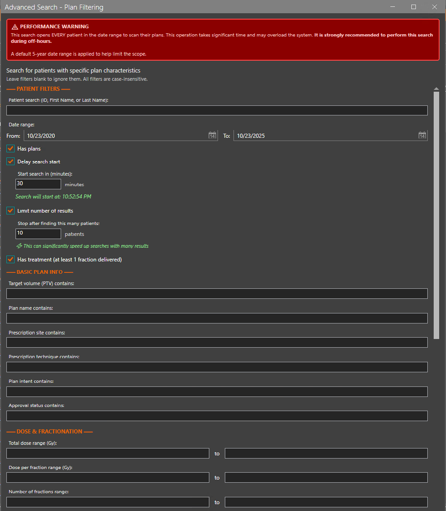

# DicomTools 2.0

DicomTools is built using .NET 8, which may need to be installed.
It uses [https://github.com/fo-dicom/fo-dicom](fo-dicom) library to handle DICOM communication and files.
At the moment there's no dependency on ESAPI. All commands, except search, create a reference tree having RT-Plans as root elements.
Data not connected to any plan is managed as well and called unconnected. All commands handle multiple patient's data, except retrieve.

## What's New in V2.0

### Core Functionality
- **True Selective Retrieval**: 4-step hybrid approach that filters RT-Plans before full data download:
  1. Query for RT-Plan series in the study
  2. Retrieve and parse ONLY RT-Plan instances to filter locally
  3. If matching plans found, perform full study retrieval (structure sets, doses, images)
  4. Export only the matched plans and their referenced data

- **Web-Based UI**: Integrated browser-based interface for easier batch file generation and management
  - Intuitive form-based command builder
  - Patient List Builder integration (JSON handoff from ESAPIPatientBrowser)
  - Multi-patient batch file generation with proper per-patient/per-plan command separation
  - Settings management with persistent storage

### Improvements
- Fixed multi-patient batch generation to correctly handle patient-specific plan filters
- Improved error handling and logging for selective retrieval operations
- Enhanced plan filtering logic to work with RT-Plan Label field
- Better handling of approval status filtering with `--onlyApprovedPlans`

## Previous Versions

### V1.2
- Added TLS option to retrieve command to work with secure DICOM (C-GET).
- Note that ARIA DICOM Services do not support C-MOVE with secure DICOM.

### V1.1
- Added C-GET support to retrieve command to avoid incoming C-STORE requests coming from different connection.
- Added options.json handling. More in Configuration chapter.


## Usage
    Description:
      DicomTools contains 4 different Dicom tools.

    Usage:
      DicomTools [command] [options]

    Options:
      --version       Show version information
      -?, -h, --help  Show help and usage information

    Commands:
      retrieve  Retrieve patient data using Q/R.
      store     Store patient data using C-STORE.
      search    Search dicom tag values from given path recursive.
               Examples:
                List all where PatientId is Phantom-1 and show modality:
                  --tag "(0010,0020)=Phantom-1" --tag "(0008,0060)=?" --path X:\Data --searchPattern *.dcm --showStatistics
               List all treatment unit names:
                  --tag "(300A,00B0)/(300A,00B2)=?" --path X:\Data --searchPattern RP*.dcm --showStatistics
      show      Shows plans and related data as a tree from given path recursive.

## Retrieve

    Description:
      Retrieve patient data using Q/R.

    Usage:
      DicomTools retrieve [options]

    Options:
      --patientId <patientId> (REQUIRED)    Id of the patient to retrieve data.
      --planId <planId>                     Id of the plan to retrieve data (filters by RT-Plan Label).
      --onlyApprovedPlans                   Retrieve only approved plans.
      --newPatientId <newPatientId>         New patient id for the saved data.
      --newPatientName <newPatientName>     New patient name for the saved data.
      --anonymize                           Anonymize all the saved data. [default: False]
      --path <path> (REQUIRED)              Path where to export files.
      --showTree                            Shows the retrieved data as a tree. [default: False]
      --hostName <hostName> (REQUIRED)      Name of the Dicom Service host.
      --hostPort <hostPort> (REQUIRED)      Port number of the Dicom Services configuration.
      --callingAet <callingAet> (REQUIRED)  AET of the sender.
      --calledAet <calledAet> (REQUIRED)    AET of the Dicom Services.
      --useGet                              Use C-GET instead of C-MOVE. [default: False]
      --useTls                              Use TLS when connecting. [default: False]
      -?, -h, --help                        Show help and usage information

Retrieve command calls DICOM SCP (like Varian Dicom DB service) and uses DICOM Query/Retrieve to fetch DICOM data of the given patient.

### Selective Plan Retrieval (V2.0)
When **--planId** or **--onlyApprovedPlans** is specified, the retrieve command uses **True Selective Retrieval**:

**The 4-Step Hybrid Process:**
1. **Query**: Identifies all RT-Plan series in the patient's study at the DICOM server level
2. **Retrieve & Filter**: Downloads ONLY RT-Plan instances and parses them locally to find matches based on:
   - Plan ID (matches against RTPlanLabel DICOM tag)
   - Approval Status (filters for Approved plans if `--onlyApprovedPlans` is set)
3. **Full Study Retrieval**: If matching plans are found, performs a complete study retrieval to ensure all referenced data is available
4. **Selective Export**: Filters and exports ONLY the matched plans and their referenced objects:
   - RT Structure Sets and their referenced CT/MR images
   - RT Dose files
   - Beam images (DRR, RT Images)
   - Registrations and associated data

**Performance Benefits:**
- For patients with many plans (10+), selective retrieval can reduce processing time by 50-80%
- Network traffic is minimized by filtering before full data download
- Only relevant data is exported, keeping the target folder clean

**Without Filters:**
If neither `--planId` nor `--onlyApprovedPlans` is specified, all patient data is retrieved (original behavior).

### Anonymization
Possible anonymization happens when copying files from temporary folder to given **--path**.
Temporary folder is deleted when all data has been processed.
If anonymization option is used, **--newPatientId** and **--newPatientName** needs to be given.

### Batch Processing

For automated batch processing, use the `--force` flag to skip confirmation prompts:

```batch
DicomTools.exe retrieve --patientId "Patient1" --planId "PlanA" --force --path "C:\Export\Patient1" --hostName "server" --hostPort "51402" --callingAet "SCU" --calledAet "SCP"
DicomTools.exe retrieve --patientId "Patient2" --planId "PlanB" --force --path "C:\Export\Patient2" --hostName "server" --hostPort "51402" --callingAet "SCU" --calledAet "SCP"
```

## Web-Based UI (New in V2.0)

DicomTools now includes an integrated web-based user interface for easier batch file generation and command building. The UI is located in `DicomTools/UI/public/`.


### Features

**Command Builder:**
- Form-based interface for all DICOM operations (Retrieve, Store, Search, Show)
- Real-time command line preview
- Input validation and helpful tooltips
- Persistent settings storage in browser localStorage

**Patient List Builder Integration:**
- Import patient lists from ESAPIPatientBrowser via JSON handoff files
- Multi-patient batch file generation with per-patient/per-plan command separation
- Automatic plan ID propagation from handoff files
- Support for filtering specific plans per patient
- Advanced search capabilities for complex filtering scenarios



**Batch File Generation:**
- Generates ready-to-run Windows batch (.bat) files
- Proper error handling and logging built into batch scripts
- Multi-patient mode with automatic per-patient folder creation
- Timestamp-based file naming for tracking

**Settings Management:**
- Configure DICOM server connection parameters
- Set default export paths
- Save DicomTools.exe location
- All settings persist between sessions


### Usage

1. Navigate to the `DicomTools/UI/public/` directory
2. Open `index.html` in a web browser
3. Configure your DICOM server settings in the Settings panel
4. Use the Export tab to build retrieve commands or import patient lists
5. Click "Generate Batch File" to create an executable .bat file
6. Run the generated batch file to process your DICOM operations

### Patient List Builder Integration

The UI seamlessly integrates with the ESAPIPatientBrowser application:


1. In ESAPIPatientBrowser, select patients and plans
2. Export the selection (creates a JSON handoff file)
3. In DicomTools UI, click "Import JSON" and select the handoff file


4. The UI automatically populates:
   - All patient IDs
   - Per-patient plan selections
   - Export paths
5. Generate a multi-patient batch file that processes each patient/plan combination correctly

**Example Generated Batch Command:**
```batch
"%_DT_EXE%" retrieve --patientId "KU_PMRT_9" --path "C:\Temp\DICOMExport\20251015\KU_PMRT_9" --planId "RAD Model2" --force --showTree --hostName "172.20.169.117" --hostPort "51402" --callingAet "PYNETDICOM" --calledAet "ECLIPSE_DB"
"%_DT_EXE%" retrieve --patientId "KU_PMRT_8" --path "C:\Temp\DICOMExport\20251015\KU_PMRT_8" --planId "Plan9" --force --showTree --hostName "172.20.169.117" --hostPort "51402" --callingAet "PYNETDICOM" --calledAet "ECLIPSE_DB"
```

## Store

    Description:
      Store patient data using C-STORE.

    Usage:
      DicomTools store [options]

    Options:
      --path <path> (REQUIRED)              Path where to search for files to send to SCP.
      --searchPattern <searchPattern>       File search pattern, for example *.dcm. [default: *.*]
      --showMessages                        Controls whether status messages are shown or not. [default: True]
      --statusFileName <statusFileName>     Name of the file containing list of files stored. Storing of listed files will
                                            be skipped.
      --machineMapping <machineMapping>     MachineMapping, like A=B C=D
      --defaultMachines <defaultMachines>   DefaultMachines, like RDS=HALCYON 23EX=D
      --hostName <hostName> (REQUIRED)      Name of the SCP host.
      --hostPort <hostPort> (REQUIRED)      Port number of the SCP configuration.
      --callingAet <callingAet> (REQUIRED)  AET of the sender.
      --calledAet <calledAet> (REQUIRED)    AET of the SCP.
      -?, -h, --help                        Show help and usage information

In some cases, like specified treatment unit not found, store command stops.
If you specify **--statusFileName**, all successfully stored files will be listed there. After fixing the issue,
like specifying correct treatment unit mapping using **--machineMapping** option,
you can retry the command and it will continue from last stored file.

Sometimes treatment unit name is taken away from RT-PLAN.
In that case you can use **--defaultMachines** option to specify treatment unit for machine model found from RT-PLAN.

## Search

    Description:
      Search dicom tag values from given path recursive.
      Examples:
      List all where PatientId is Phantom-1 and show modality:
        --tag "(0010,0020)=Phantom-1" --tag "(0008,0060)=?" --path X:\Data --searchPattern *.dcm --showStatistics
      List all treatment unit names:
        --tag "(300A,00B0)/(300A,00B2)=?" --path X:\Data --searchPattern RP*.dcm --showStatistics

    Usage:
      DicomTools search [options]

    Options:
      --tag <tag> (REQUIRED)           Dicom tags to search in a format (gggg,eee)=value.
                                   For example --tag (0010,0020)=PatientId --tag (0008,0060)=CT.
      --path <path> (REQUIRED)         Path where to search for files including given tag.
      --searchPattern <searchPattern>  File search pattern, for example *.dcm. [default: *.*]
      --showStatistics                 Show statistics
      --showOnlyDirectories            List only directories, not files.
      -?, -h, --help                   Show help and usage information

Search command is useful, when you have a lot of DICOM data in some folder and need to find some files based on tag values.

## Show

    Description:
      Shows plans and related data as a tree from given path recursive.

    Usage:
      DicomTools show [options]

    Options:
      --path <path> (REQUIRED)             Path where to search for files.
      --searchPattern <searchPattern>      File search pattern, for example *.dcm. [default: *.*]
      --format <flat|tree> (REQUIRED)      Either flat list or tree. [default: tree]
      --defaultMachines <defaultMachines>  DefaultMachines, like RDS=HALCYON 23EX=D
      -?, -h, --help                       Show help and usage information

Show command goes thru all files in given **--path** recursively and creates a reference tree from all
files found and shows the result as a flat list or as a tree (default).

## Configuration
You can configure various settings in configuration file **appsettings.json**.

## options.json
You can create a options.json file into the directory where you are running the tools. Default values for all command line options are read from that file.

Here's an example:
```json
{
  "RetrieveOptions": {
    "HostPort": 4242,
    "CallingAet": "MYAET",
    "CalledAet": "SCPAET",
    "ShowTree": true,
    "HostName": "localhost",
    "UseGet": false,
    "Force": false,
    "OnlyApprovedPlans": false
  },
  "SearchTagOptions": {
    "Tag": [
      "(300A,00B0)/(300A,00B2)=?"
    ],
    "Path": "C:\\Temp\\DICOM\\FileDicomExport"
  },
  "ShowOptions": {
    "Path": "C:\\Temp\\DICOM\\FileDicomExport"
  },
  "StoreOptions": {
    "Path": "C:\\Temp\\DICOM\\FileDicomExport",
    "HostName": "localhost",
    "HostPort": 4242,
    "CallingAet": "MYAET",
    "CalledAet": "SCPAET"
  }
}
```

**New in V2.0:**
- Added `"Force": false` to RetrieveOptions for batch processing support
- Added `"OnlyApprovedPlans": false` to RetrieveOptions for plan filtering

#### Logging
Currently all logs are only shown in console. You can change the log level in appsettings.json to get more information if something is not working as expected.

#### SCP
Retrieve command creates a SCP-service in separate thread for handling in-coming C-STORE requests.
TCP/IP port number can be set in appsettings.json. Default port number is 104.

#### Firewall configuration
DicomTools communicate with SCP using TCP/IP port defined in parameters. That port needs to be open from client to the SCP server.
As retrieve command uses query/retrieve and DICOM C-MOVE to tell SCP to send data to DicomTools SCU using DICOM C-STORE.
Configured TCP/IP port needs to be open **from** SCP to SCU.

#### Anonymization
Anonymization options can be changed in appsettings.json. More information about the anynomization in next chapter .

## Troubleshooting

### Common Issues

**"C-Move response [8]: Cannot understand - Unexpected exception during MOVE"**
- This error originates from the Eclipse/ARIA DICOM server, not DicomTools
- Usually occurs with patients who have many RT-Plan series (30+)
- The Eclipse server may have internal limitations or timeout issues
- **Solutions:**
  - Try retrieving data for a different patient first to verify connectivity
  - Contact Varian support with the Eclipse server logs
  - Try retrieving without plan filters to get all data (slower but may work)

**Multi-Patient Batch Processing Failures**
- When processing multiple patients, some may succeed while others fail
- Check the batch file log output to identify which patient failed
- Failed patients can be re-processed individually
- Use `--force` flag to avoid manual intervention

**Plan Filtering Not Working**
- Ensure you're using the exact RT-Plan Label as it appears in Eclipse
- Plan IDs are case-sensitive
- Use `--showTree` to see all available plans and their exact labels

**"No connection could be made because the target machine actively refused it"**
- Verify DICOM server is running and accessible
- Check firewall rules (both client→server and server→client)
- Verify port numbers in configuration match the server
- For Eclipse: Ensure DICOM services are enabled and listening

### Performance Tips

**For Patients with Many Plans:**
1. Use `--planId` to retrieve only the specific plan you need
2. Use `--onlyApprovedPlans` to filter out draft/unapproved plans
3. Selective retrieval can reduce processing time by 50-80%

**For Batch Processing:**
1. Always use `--force` to avoid manual prompts
2. Consider processing in smaller batches (5-10 patients at a time)
3. Use the Web UI to generate properly formatted batch files

**Network Optimization:**
- Use C-GET instead of C-MOVE when possible (`--useGet`)
- Ensure adequate network bandwidth between DicomTools and DICOM server
- Consider running DicomTools on the same network segment as the DICOM server

## Anonymization

Anonymization options are set in configuration file. Default is to use similar options as DCIE uses by default.

**AriaSecurityProfile.csv** contains list of anonymization related tags and what to do with the tag values.

**BasicSecurityProfile.csv** is according to DICOM standard basic security profile. Note that if you use it, you can't import data into ARIA as
many needed tags are removed/cleared.

More information here: [DICOM PS3.15 2024e - Security and System Management Profiles](https://dicom.nema.org/medical/dicom/current/output/chtml/part15/chapter_e.html).

```
Example (default settings): 
  "DicomAnonymizer": {
    "SecurityProfileFileName": "AriaSecurityProfile.csv",
    "SecurityProfileOptions": [
      "CleanDesc",
      "RetainDeviceIdent"
    ]
  }
```